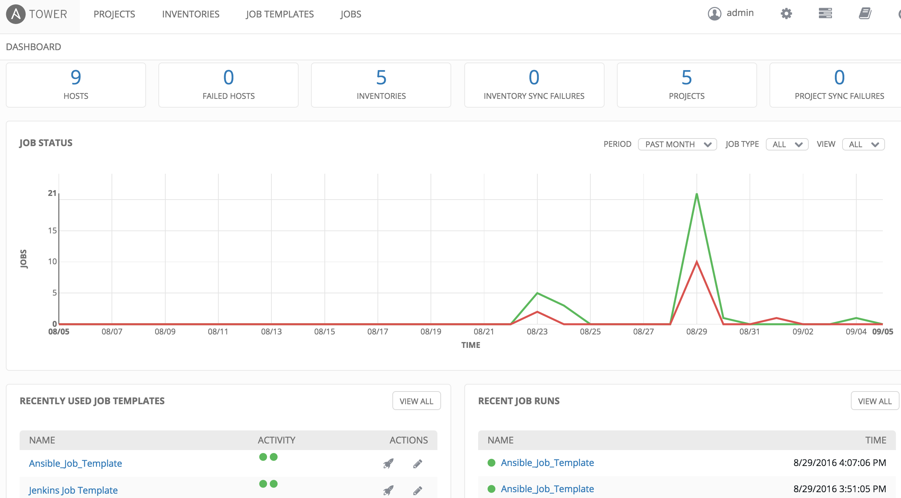

+++
title = "Kubeflow : Scaling ML with Kubernetes"
date = 2018-05-29T14:22:26+05:30
tags = ["kubeflow", "kubernetes"]
categories = []
summary = "Kubeflow is a toolkit to manage different areas of machine learning like model develop/train/deploy etc. Read the post to know why is an important milestone."
canonicalURL = "https://www.infracloud.io/blogs/kubeflow-machine-learning-kubernetes/"
showTableOfContents = true
+++

> *This post was originally published on [InfraCloud's blog](https://www.infracloud.io/blogs/kubeflow-machine-learning-kubernetes/).*

Machine learning(ML) is being adopted by organizations of all sizes but
one of the key challenges has been deploying and managing the
infrastructure for machine learning workloads. Kubeflow launched in
Kubecon US 2017 aims to solve the problem – by running machine learning
on Kubernetes as the platform. Ever since the launch of Kubernetes, it
is being adapted to different application categories ([Check the first
section and image from this
article](https://www.infracloud.io/blogs/machine-learning-kubernetes/)).

## Developing an ML Solution

A typical machine learning problem goes through phases and multiple
iterations based on success/failure rate of any given phase. At a rough
level we can imagine the flow to be roughly like:

Data gathering and preparation are the most important parts of this
activity. Then comes the crucial portion of choosing a model and then
training the data with that model. This phase may involve either
fine-tuning the model or choose a completely different model altogether.
Once the model is trained and the results are satisfactory, the model
needs to be deployed and scaled as needed. The deployment could be to a
cloud server or to an edge device depending on use case and operational
concern for both cases might be different.

## Kubeflow: ML on Kubernetes

One of the key factors, as we mentioned earlier while developing ML
solution, is the operational parts of it. For example when training a
model – you need to scale the infrastructure so that the training can be
finished in a reasonable time. Similarly, once the training is done, you
need to deploy, maintain and operate the deployed model. While one
can use virtual machines for this, containers are becoming the standard
way to package and deploy applications. Similarly, Kubernetes is
becoming the defacto standard for managing and orchestrating containers
at scale.

Kubeflow builds on Kubernetes as a platform and uses CRDs, controllers &
operators (These are some of the ways to [extend Kubernetes in a native
way](https://www.infracloud.io/kubernetes-consulting-partner/), unfortunately, we will have to cover them in a separate blog post).
This is explained in detail in the kubeflow [job design specification
for
tensorflow](https://github.com/kubeflow/training-operator/blob/v0.1.0/tf_job_design_doc.md). Kubeflow's [tensorflow
operator](https://github.com/kubeflow/training-operator) can use to train
model developed using [tensorflow](https://www.tensorflow.org/), which
is one of the most popular machine learning frameworks. However,
operator support is not restricted to Tensorflow only, we also see
operators are there in development
for [PyTorch](https://github.com/kubeflow/pytorch-operator), [Caffe2](https://github.com/kubeflow/caffe2-operator).

### Installing Kubeflow

Kubeflow can be used anywhere Kubernetes runs. It uses
[Ksonnet](https://github.com/ksonnet) to typically manage all Kubernetes
manifests.  You can follow user guide which provides all installation
steps in detail. Typically you need to have worker nodes with a high
configuration of memory, CPU etc.

Let's walk through each flow of developing an ML solution and how
Kubeflow aids the process.

### Developing Model

Most of ML developers are familiar with the Jupyter notebook for model
development. Kubeflow uses [Jupyter
hub](https://jupyterhub.readthedocs.io/en/stable/), where  user can
login through the dashboard and create notebook server for himself. A
user can also mention kind of compute resource like CPU/[GPU](https://www.infracloud.io/build-ai-cloud/). Setting
specific resources avoids potential noisy neighbour issues in case of
multiple users.

### Training Model

As mentioned above Kubeflow creates Custom Resource
Definition(CRD) which can be used to define training job. Below job
specification can be used to run tensorflow training job.

Along with Tensorflow, we can also use operators for
[PyTorch](https://github.com/kubeflow/pytorch-operator),
[Caffe2](https://github.com/kubeflow/caffe2-operator) to define training
job specification for the particular framework. However, running
distributed training is the more interesting case. Tensorflow operator
supports running distributed training job where you can mention master,
multiple workers and parameter servers.

### Serving Model

Once you have developed model you need to deploy or serve model so that
it can be used by end users. You can use
[Seldon](https://www.seldon.io/) which is framework designed to deploy
ML models on Kubernetes. We also have CRDs for serving models. Eg.
Tf-serving can be used to define Tensorflow model deployment where it
covers advance model deployment use cases.

## Conclusion

In machine learning research, the focus is on ML models/algorithms. But
applying machine learning research requires a good understanding of
infrastructure which may not be a core strength of many ML engineers.
Kubeflow bridges this gap by making infrastructure easy and scalable
without knowing all details. The approach taken by Kubeflow of using
existing abstractions of Kubernetes and extending it with the additional
layer is really promising. There are also alternatives to Kubeflow
like RiseML, [PolyAxon](https://polyaxon.com/docs/) which can be used
on Kubernetes, but that's probably for another blog post.
