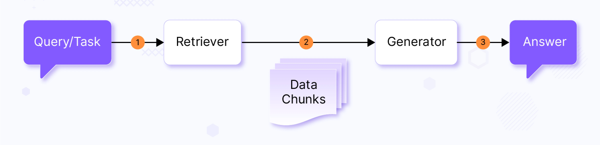
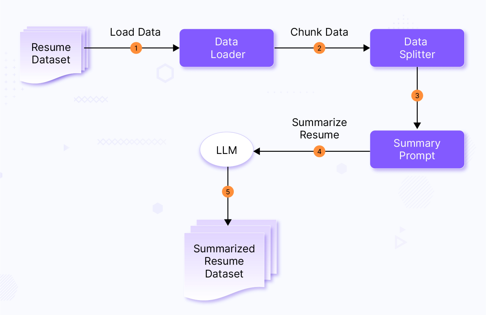
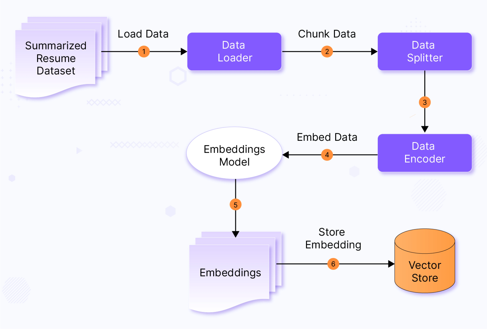
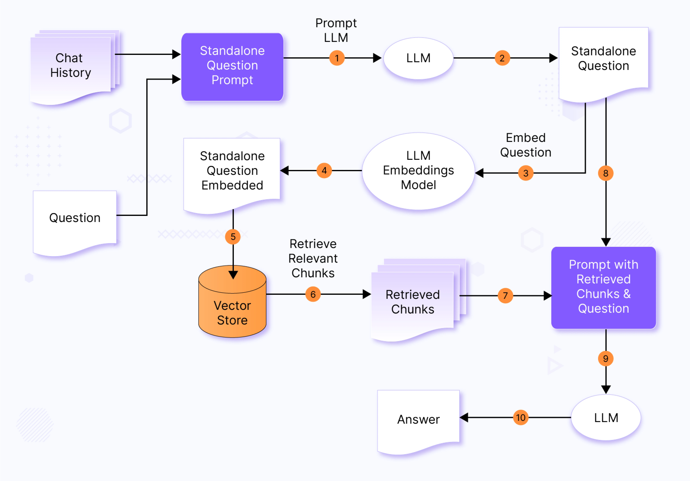
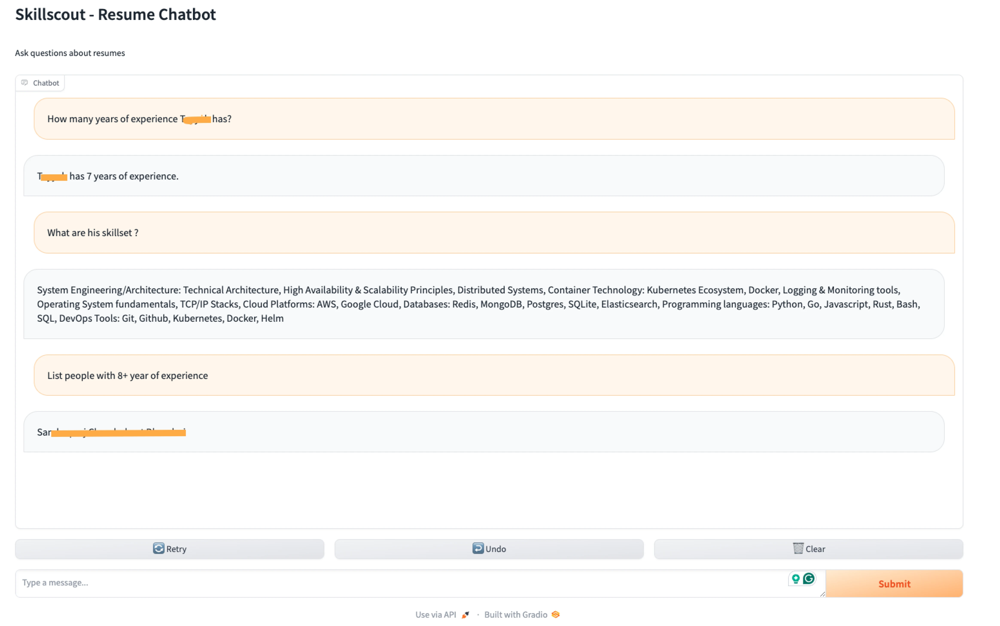

+++
title = "Retrieval-Augmented Generation: Using your Data with LLMs"
date = 2024-03-26T14:22:26+05:30
tags = ["AI App", "retrieval-augmented-generation", "llms", "skillscout", "rag-implementation"]
categories = []
summary = "What is Retrieval-Augmented Generation (RAG)? Learn how to use RAG to train LLMs on specific data within the demo app for accurate and contextual responses."
canonicalURL = "https://www.infracloud.io/blogs/retrieval-augmented-generation-using-data-with-llms/"
showTableOfContents = true
+++

> *This post was originally published on [InfraCloud's blog](https://www.infracloud.io/blogs/retrieval-augmented-generation-using-data-with-llms/).*

Large Language Models (LLM) are great at answering questions based on which they have been trained on, mostly content available in the public domain.
However, most enterprises want to use the LLMs with their specific data.
Methods like LLM finetuning, RAG, and fitting data into the prompt context are different ways to achieve this.

This article explains the basics of Retrieval-Augmented Generation (RAG) and demonstrates how your data can be used with LLM-backed applications.

## Understanding Retrieval Augmented Generation (RAG)

Retrieval-Augmented Generation (RAG) involves retrieving specific data chunks from an indexed dataset and using a Large Language Model (LLM) to generate an answer to a given question or task.
This process typically consists of two main components at a high level:

1. **Retriever**: This component retrieves relevant data for the user-provided query.
2. **Generator**: The generator performs an augmentation process on retrieved data (usually by putting data in prompt context) and feeds data to the LLM, to generate a relevant response.

 *(High-level RAG)*

## SkillScout - Implementing Retrieval Augmented Generation (RAG)

While the above explanation gives a very high-level overview of the RAG, below we take an example of RAG implementation for the case internally explored at InfraCloud.

It started with an internal ask from talent management team,

> "Team, as of today, when we are looking for a specific skills for a customer from our talent, we mostly scan through updated resumes or try to match based on our past memories, if a person has certain skillset.
> This is not very efficient.
> We can explore, if we can leverage LLM to help us query our resume dataset better."

Let's say we have a dataset of resumes/CVs of candidates from an organization and the talent search/management team is looking to extract valuable insights from the dataset via a ChatGPT kind of interface through Question-Answering.
We are giving a nickname to our solution, "SkillScout".

Samples prompts/questions we are expecting from users of the solution:

- "Show me candidate skilled in {skill}"
- "Show me candidates with {certification name} certification"
- "Find resume with {x-y} years of experience"
- "What are the skills of {candidate} ?"
- "How much experience does {candidate} have?"

### Implementation

This section gives a brief overview of different components within our solution and data flow amongst them.

We use [langchain](https://python.langchain.com/docs/get_started/introduction) and [OpenAI text generation](https://platform.openai.com/docs/guides/text-generation) APIs for implementation, but most of the parts explained in the below pipelines are customizable.
You can refer to the source from [SkillScout GitHub Repo](https://github.com/infracloudio/skillscout/tree/main).
Eg.
LLM or Embeddings model could be swapped with any compatible implementation, as you can notice from [the core package](https://github.com/infracloudio/skillscout/tree/main/core).

We have three pipelines at a high level:

#### Document Preprocessing pipeline

This pipeline handles the extraction of specific details from resumes in various PDF formats.
Given the diverse structures of resumes, this step is crucial for retrieving relevant information based on user queries.

 *(Document Preprocessing Pipeline)*

The summary prompt below is sent to LLM along with resume data.

```
Please extract the following data from the resume text provided in
triple quotes below and provide them only in format specified:

Name of the candidate:
Professional Summary:
Total years of experience:
Skills (comma separated):
Companies worked for (comma separated):
Education:
Certifications (comma separated):

When extracting the candidate's total years of experience if available
in the resume text or calculate the total years of experience based on
the dates provided in the resume text.

If you are calculating then assume current month and year as Jan 2024.

Resume Text:
{text}

```

#### Vector Store Ingestion pipeline

Once the resumes are processed and summarized, this pipeline stores and indexes all the resume data with a vector store.
This ensures the information is readily available and easily accessible for the Retrieval-Augmented Generation (RAG) process.
We use "sentence-transformers" encodings for our pipeline, but [the MTEB leaderboard](https://huggingface.co/spaces/mteb/leaderboard) is a good source to compare different embedding models.

 *(Vector Store Ingestion Pipeline)*

#### Retrieval Augmented Generation pipeline

When a new user query arrives, the query undergoes a formatting phase, where it is restructured based on past chat history and previous questions.
This step ensures that the query is not only understandable but also aligns with the context of the ongoing conversation.

Next, the reformatted query is fed into our LLM embeddings model to calculate its embedding.
This process converts the query into an embedded query.

With the query now embedded, we move on to a pivotal step: the vector similarity search operation.
Here, we compare the embedded query against a vector store containing relevant information.
This search with retriever enables us to retrieve highly relevant and contextually appropriate data, setting the stage for a more informed response.

Armed with the retrieved information, we construct a prompt tailored to the LLM model, enriching it with the contextual data gleaned from the vector search.
This custom prompt is then presented to the LLM, which leverages it to generate responses that are not just accurate but also deeply contextualized to the user's query and the ongoing conversation.

 *(Retrieval Augmented Generation Pipeline)*

Based on chat history and query from a user, we first check if we should reformat the question and reduce its dependency on the chat history.

Let's say we have two questions, Query 1: What skills does John Doe have?
Query 2: What's his total years of experience?

Now in Query 2, **_"his"_** is a possessive pronoun which refers to John Doe.
We may rewrite Query 2 as "What's John Doe's total years of experience?"

This helps in embedding contextual information, such as chat history, into the query,

```
Chat History:
{chat_history}

Question: {question}

Given a chat history and the latest user question which might
reference context in the chat history, formulate a standalone question
which can be understood without the chat history.

Do NOT answer the question, just reformulate it if needed and
otherwise return it as is.
```

Generation with retrieved content from the vector store is done via the following prompt.

```
Context has resume data of candidates.
Answer the question only based on the following context.
If you don't know the answer, just say that you don't know.
Be concise.

Context: {context}
Question: {question}
Answer:

```

### SkillScout demo

We load our minimal Resume data as mentioned in [SkillScout project README](https://github.com/infracloudio/skillscout).
After generating a summary of resumes and loading data in the vector store, we can see the chat interface via the app command.

You can see in the screenshot below that we ask about a particular candidate's experience and skill set in the following question.
We also ask people with certain experience.



## Enhancing RAG Implementation for production applications

One of the key reasons behind RAG's popularity among application developers is its relatively lower barrier to entry compared to directly working with LLMs.
With a background in application development, one can easily get started with RAG.
Additionally, RAG allows developers to experiment with different foundational or customized LLMs and compare the results, offering flexibility and exploration.

However, RAG implementation could be nuanced and complex, depending on factors such as:

- **Accuracy expectations**: The level of accuracy required for the task at hand will influence the design and implementation of the RAG system.
- **Hallucination prevention**: Ensuring the generated responses are accurate and relevant, without introducing false or misleading information, is crucial.
- **Dataset scale and nature**: The dataset's size and nature will impact the retrieval process and the overall performance of the RAG system.

While the above implementation demonstrates the feasibility of the RAG approach, several considerations are crucial for deploying RAG in production applications.

**Factors for Retrieved Chunks in RAG:**

1. **Relevance**: Chunks should be highly relevant to the query or context, ensuring that generated responses are on-topic and useful.
2. **Diversity**: Chunks should be diverse, avoiding redundancy and providing a broad range of information.
3. **Contextuality**: Chunks should be contextual, considering the conversation history for coherent responses.
4. **Accuracy**: Ensure retrieved information is accurate and factually correct to prevent incorrect distribution of facts across chunks.
5. **Ranking**: The order of retrieved chunks matters; re-ranking steps post-retrieval and incorporating user feedback improves relevance.

**Optimizing the RAG Pipeline:**

Optimizing the RAG pipeline is essential for generating better and more relevant responses.
Considerations include:

- **Privacy and security**: Ensure personal and sensitive information is not revealed.
- **Data management policies**: Adhere to data management policies, including forgetting past data and injecting fresh data as per requirements.
- **Scalability, reliability, and cost-efficiency**: Ensure the RAG solution is scalable, reliable, and cost-efficient for enterprise usage.

Addressing these considerations can optimize RAG implementations for production applications, providing users with accurate, diverse, and contextually relevant responses while maintaining privacy and security.

What are other datasets where you can consider using the RAG technique?

| Dataset | Use case |
|---|---|
| **Doc QA** | A chatbot can answer questions based on product documentation. |
| **Medical QA** | We can have a bot answering questions about different medicines based on actual manuals, etc. |
| **Product QA** | Product buyers/consumers can ask questions about the product info and any additional information. |

## Comparing RAG and LLM finetuning

When it comes to integrating your data with LLMs, two prominent methods stand out: LLM finetuning and Retrieval-Augmented Generation (RAG).
Each approach has its own advantages and drawbacks, and ongoing developments continuously enhance their efficacy.
In a practical solution, you may use a **combination** of both to get better results.

| LLM Finetuning | RAG |
|:---:|:---:|
| Alters LLM | No alterations to LLM |
| Less adaptability/flexibility | More adaptability/flexibility |
| Tightly coupled with LLM | There is no tight dependency on LLM, the model can be swapped |
| Data set size constraints overall considering the cost of finetuning | No data restrictions as such, cost marginally increases with dataset size increase |

## Conclusion

In conclusion, Retrieval-Augmented Generation (RAG) represents a powerful approach to leveraging Large Language Models (LLMs) for tasks requiring contextual understanding and data retrieval.

RAG enables more accurate and contextually relevant responses, making it particularly useful for applications that provide tailored responses to user's queries by extracting information.

As advancements in GenAI technology continue, we can expect RAG to play an increasingly important role in enabling more intelligent and context-aware interactions with data.

We hope you found this post informative and engaging.
We'd love to hear your thoughts on this post — start a conversation on [LinkedIn](https://www.linkedin.com/in/sanketsudake/).

## References

- [Retrieval-Augmented Generation for Knowledge-Intensive NLP Tasks](https://arxiv.org/abs/2005.11401)
- [Dense Passage Retrieval for Open-Domain Question Answering](https://arxiv.org/abs/2004.04906)
