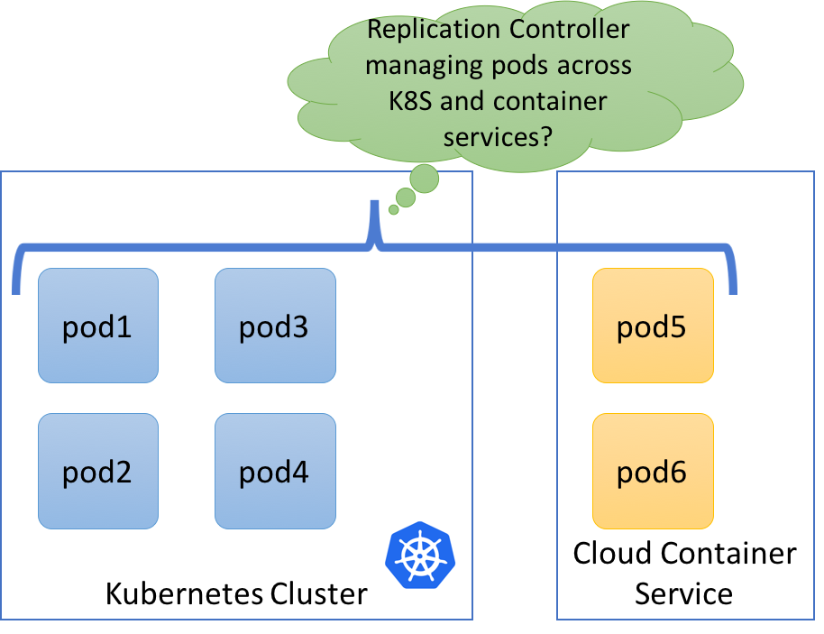
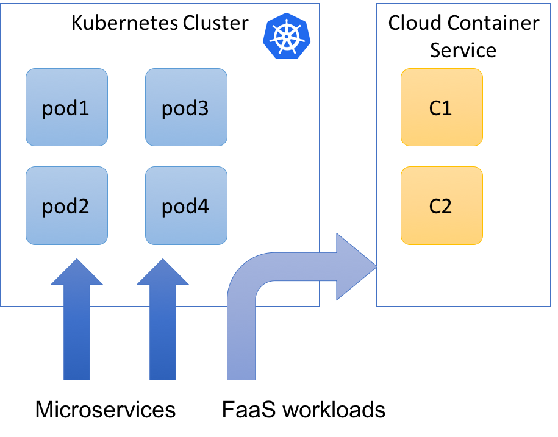

+++
title = "Virtual Kubelet & New Hybrid World"
date = 2018-05-08T14:22:26+05:30
tags = ["virtual kubelet", "kubernetes"]
categories = []
summary = "The virtual kubelet is an exciting development - it brings many different hybrid services on the same platform and gets you best of all worlds."
canonicalURL = "https://www.infracloud.io/blogs/hybrid-virtual-kubelet/"
showTableOfContents = true
+++

> *This post was originally published on [InfraCloud's blog](https://www.infracloud.io/blogs/hybrid-virtual-kubelet/).*

Thanks to Harshal & [Vishal](https://twitter.com/vishal_biyani) for help with this article and the work that was done around this post.

After a long time, I have been excited like a kid about technology.
I first heard from Harshal about virtual kubelet in a weekly meeting.
The discussion that followed made us realize the potential of what virtual kubelet can be.
We could not stop but start playing with it and thinking of a few things to try.
This post is a summary of our trials but more than that of errors that we encountered.
The errors we faced are natural considering that we are playing with 0.2.x version of virtual kubelet and there is a lot of work still to be done.

## Virtual Kubelet Introduction

At its core, virtual kubelet is a kubelet implementation that gives you the ability to connect with a provider using it's API.
The provider should have the ability to run container workloads.
The way a normal kubelet manages pods running on a node, virtual kubelet can run or manage pods running on the provider.
As of this writing these providers where pods will run happen to be the Container as a Service(CaaS) platform such as [AWS Fargate](https://aws.amazon.com/fargate/) and [Azure Container Instances(ACI)](https://azure.microsoft.com/en-in/services/container-instances/).
So the target platform can be thought of as a kubernetes node with virtual kubelet managing the pods.
In case of ACI or AWS Fargate, the capacity of the node is unlimited - so they can be thought of as an extension of Kubernetes.
This paradigm can lead to a lot of interesting use cases and architectural models as we will see in rest of the article.
Let's look at some specific kind of workloads and how they can fit in this new paradigm.

### Microservices

Imagine your [microservices running on Kubernetes](https://www.infracloud.io/monolith-microservices-modernization/) on your choice of the cloud provider and the traffic spikes suddenly.
In this case, instead of creating another node, is it possible to schedule the extra load on one of container service platforms?
Since container instances take relatively less time to start as compared to a virtual machine, the ability to respond to spikes in traffic can be much better.
This will allow flexible and effective distribution of "bursts" in the workload and reduce the cost overall.

There are of course challenges in achieving this - for example how will [networking](https://www.infracloud.io/cloud-native-networking-services/) be affected when 4 pods of a replica are running inside the Kubernetes cluster and 2 replicas in a container service platform such as ACI?
The second challenge is [storage](https://www.infracloud.io/data-storage-consulting-services/) - any service that needs storage, and has to be distributed across disparate platforms such as [Kubernetes and a container service](https://www.infracloud.io/kubernetes-consulting-partner/), how will that work is an open topic as of now.



### FaaS workloads along with Kubernetes

FaaS workloads that run on Kubernetes as a platf0rm are great candidates for running on a managed container service.
These workloads are short-lived as compared to microservices.
This also allows a relatively clear separation in terms of nature of workload and scheduling for long-term vs. short-lived workloads.
Of course, there will be microservices which will be consumed by functions and will have to be accessible from functions, but this mechanism is relatively straightforward.

We did play with it by deploying [Fission](https://fission.io/) and trying to schedule the function pods on a container service, though a few things are still missing to make it work.
For example taints and tolerations need to be supported by the FaaS platform ([Issue here](https://github.com/fission/fission/issues/644)) & accessing Kubernetes services from container services runs into some issues ([issue here](https://github.com/virtual-kubelet/virtual-kubelet/issues/185)).



### Batch workloads

Very similar to FaaS workloads, batch workloads can be exclusively be scheduled.
This again allows relatively clear separation of workloads and managing static vs. dynamic capacity in a clean manner.

### VMs anyone?

While strictly not a virtual Kubelet topic, it is worth noting that some workloads still use VMs.
If you want to manage the VM's from the same control plane, there are projects like [Nomad which can be run on Kubernetes](https://github.com/kelseyhightower/nomad-on-kubernetes) or [Kubevirt](https://github.com/kubevirt) but most interesting of them all is [Virtlet](https://github.com/Mirantis/virtlet).
Virtlet allows you to run a VM as if you are running a pod and allows you interface similar to Kubectl.
It would be interesting to see if virtual kubelet in future could allow VMs as remote pods similar to virtlet.

## Challenges

Since now we know the various possibilities, let's look at some limitations we found.
It is worth noting that these limitations exist today but might be solved sooner or later.

### Networking

As of now, pods created in virtual kubelet do not share the [networking](https://www.infracloud.io/cloud-native-networking-services/) space of other kubernetes pods.
This means pods in a virtual kubelet cannot talk to pods on other nodes and vice versa.
A service can be created but the forwarding of packets does not happen to pods on virtual kubelet as regular nodes are on a different network compared to the virtual kubelet.

As of now, there is no option to have fargate or ACI instances on a user-defined virtual network.
To expose a service out of virtual kubelet pods, a separate load balancer has to be created manually which will load balance between the pods running on Virtual Kubelet.

### Logging

Pods running under virtual kubelet can store logs under particular CaaS provider only (Eg.
CloudWatch for Fargate).
Most [Kubernetes implementations](https://www.infracloud.io/kubernetes-consulting-partner/) use either Fluentd Elasticsearch Kibana or Stackdriver or similar [tooling for log aggregation](https://www.infracloud.io/observability-consulting/).
With pods running on virtual Kubelet, there is no Fluentd agent that can run and ship logs to a desired log data store.
Even if Fluentd (or any other log collector) is added as a sidecar, there is no communication with rest of the cluster.
As of now, there is no way to ship logs running on CaaS backend to another service.
I am sure with time, this will improve greatly, but this is an important aspect of debugging a pod.

### Interoperability

As a user, you would like the interface of Kubectl to work for all workloads consistently.
But kubectl commands such as `kubectl exec` does not work on pods created by virtual kubelet, due to obvious sandboxing and isolation concerns.
I think this is not a big deal-breaker as long as other things such as logging and enough information about what is going inside the container service are available.

### Pricing

The container as a service offering is great for running on demand and intermittent workloads but if you start running anything more often then the economics turns in favour of the virtual machines.
This means critical thought has to be given on the type of workloads that will run on a virtual kubelet backend.

Consider following example:

A workload that needs 1 vCPU and 2 GB RAM needs to run 24x7, then monthly cost of running this on Fargate as well as ACI is as follows:

Fargate:

```
CPU = 0.05 USD an hour
Memory = 0.0125 USD an hour
CPU = 0.05 *24 * 30 = 36 USD a month
RAM = 0.0125 * 24 * 30 = 9 USD a month
45 USD a month
```

ACI :

```
Memory = 1 container group * 86400 seconds * 2 GB * $0.000004 per GB-s * 30 days = 20.736
CPU = 1 CG * 86400 sec * 30 days * 1 vCPU * 0.000012 per vCPU-sec = 31.104
Total = 51.84 USD
```

Compared to above, an on-demand AWS EC2 instance with 2vCPU and 4GB RAM in Ohio would cost 33.408 USD a month which is much cheaper than both solutions above.
So _**Lesson learned: It is better to stick to compute resources for long-running services**_

## Opportunities

Despite the shortcomings at this stage, virtual kubelet is a great project with huge potential.
Container services are just the beginning and a lot more can be integrated in near future.
This is the new age hybrid is exciting but more importantly valuable.
You can [deploy microservices](https://www.infracloud.io/monolith-microservices-modernization/), functions, batch jobs while still keeping efficiency as close to 100% as possible.
